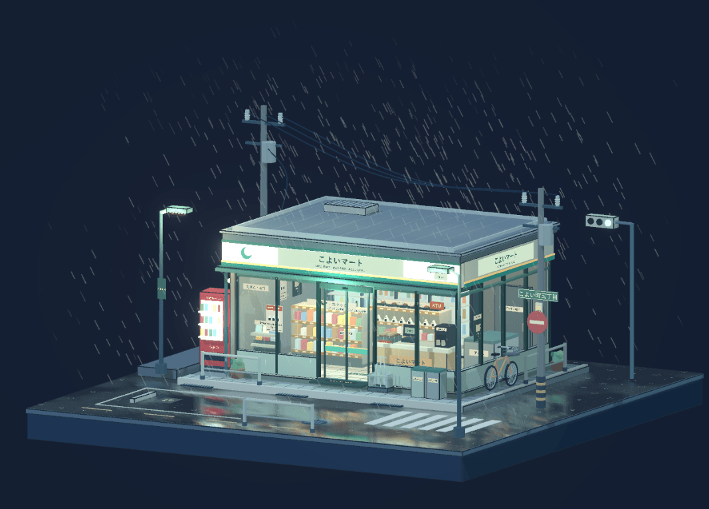

# こよいマート · 雨夜街角

<p align="center">
  
</p>

<p align="center">
  一个无界面覆盖的日式便利店雨夜微缩景观
</p>

<p align="center">
  React 19 · React Three Fiber 9 · Drei 10 · Three.js · TypeScript strict · Vite 8
</p>

## 运行

需要 Node.js 22.12+（本机验证版本为 24.15.0）和 pnpm 11。

```sh
pnpm install
pnpm dev
```

若已有开发服务器，请直接复用。默认地址为 http://127.0.0.1:5173/。

```sh
pnpm typecheck
pnpm test
pnpm build
pnpm preview
```

## 观察方式

- 鼠标左键拖动旋转，右键拖动平移，滚轮缩放。
- 触屏单指旋转，双指缩放和平移。
- 水平可完整环绕，俯仰、缩放和平移有边界；窗口改变尺寸时重新适配完整底座。
- 相机保持正交投影，可以到达水平正视和垂直顶视；自由旋转无惯性漂移，不会在松手后改变用户选择的角度。
- 默认镜头静止，无人物、音效、按钮或操作提示。

## 实现

- `src/App.tsx`：R3F Canvas、光照、泛光和质量管理。`src/scene/CameraRig.tsx` 负责正交相机和 Drei 控制器。
- `src/scene/Store.tsx` / `Interior.tsx`：完整建筑、双面玻璃、自动门和三维室内陈列，包括货架、饮料、饭团、便当、收银、咖啡及关东煮。
- `Ground.tsx` / `StreetProps.tsx`：正方形底座、街角道路、日文标识、自行车、贩卖机、雨伞架、垃圾桶、电线杆及其他设施。
- `WetRoad.tsx`：单个共享平面反射目标；使用适用于正交投影的斜裁剪矩阵，程序化积水遮罩、柔化采样和动态波动。
- `Weather.tsx`：带高度淡出的批量雨线、屋檐滴水、地面波纹和玻璃水痕。
- `simulation.ts`：可独立测试的自动门周期、交通灯周期、时间步长和雨水遮挡计算。
